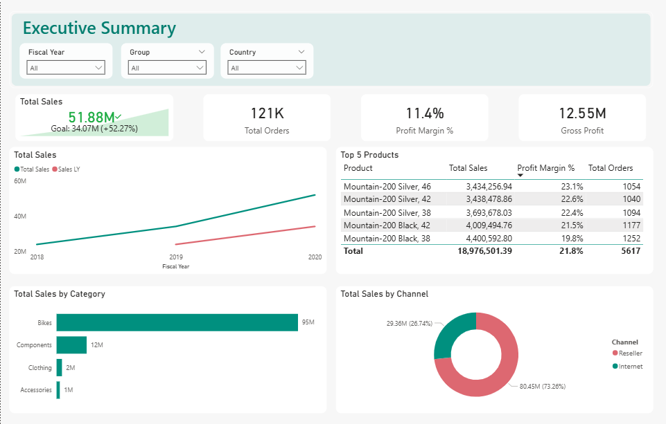
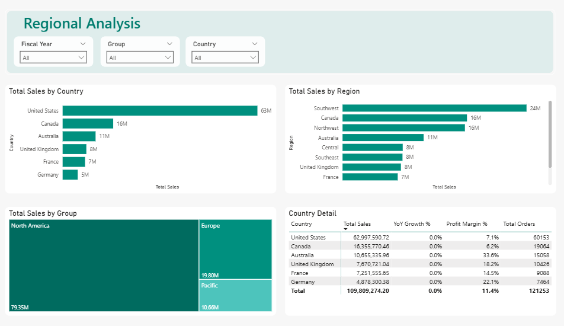
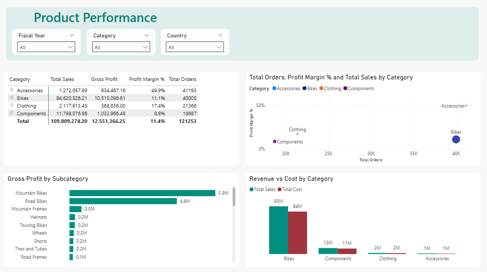

# Sales Performance Dashboard — Power BI

An end-to-end business intelligence solution built with Power BI, demonstrating full BI ownership: data modeling, DAX measure development, and multi-page dashboard delivery.

---

## Dashboard Preview

### Executive Summary

### Regional Analysis

### Product Performance

---

## Business Problem

AdventureWorks, a global bicycle manufacturer, needed a unified BI solution to monitor sales performance across fiscal years, geographies, and product categories. Stakeholders required actionable visibility into revenue trends, regional distribution, and product profitability — without relying on static spreadsheet reports.

---

## Solution

A 3-page interactive Power BI dashboard enabling stakeholders to:

- Track year-over-year revenue growth and margin trends
- Identify top-performing regions, countries, and sales channels
- Analyze product category profitability and volume vs. margin positioning
- Filter dynamically by fiscal year, product category, region group, and country

---

## Technical Highlights

### Data Model
- Star schema: central `Sales` fact table connected to `Product`, `Customer`, `Reseller`, `SalesTerritory`, `SalesOrder`, and `Date` dimension tables
- Custom calculated `Date` table covering FY2018–FY2020, with Fiscal Year logic (year starts July 1)
- All relationships validated and active; cross-filter direction optimized per use case

### DAX Measures (10 custom measures)
| Measure | Description |
|---------|-------------|
| `Total Sales` | `SUM(Sales[Sales Amount])` |
| `Total Orders` | `COUNTROWS(Sales)` |
| `Total Cost` | `SUM(Sales[Total Product Cost])` |
| `Gross Profit` | Revenue minus cost |
| `Profit Margin %` | `DIVIDE([Gross Profit], [Total Sales])` |
| `Sales LY` | Prior fiscal year sales using `SELECTEDVALUE` + fiscal year filter |
| `YoY Growth %` | Year-over-year revenue variance |
| `YTD Sales` | `TOTALYTD` cumulative revenue |
| `Product Rank` | `RANKX` dynamic product ranking |
| `Running Total Sales` | Cumulative sales over time using `CALCULATE` + `FILTER` |

### Pages
| Page | Purpose | Key Visuals |
|------|---------|-------------|
| Executive Summary | High-level KPIs and trends | KPI card, line chart, Top 5 table, donut chart |
| Regional Analysis | Geographic revenue breakdown | Bar charts, treemap, country detail matrix |
| Product Performance | Category and product profitability | Matrix with drill-down, scatter chart, bar charts |

---

## Key Insights

- **73% of revenue** comes through the Internet channel vs. 27% via Resellers
- **Bikes category** drives 86% of total revenue ($95M of $110M)
- **Accessories** has the highest profit margin at 49.9% despite lowest revenue volume
- **52.3% YoY growth** from FY2019 to FY2020 — strongest growth period in the dataset
- **North America** accounts for 72% of global sales ($79M)
- **Australia** leads all markets in profit margin at 33.6%

---

## Dataset

**Source:** AdventureWorks Sales Sample — Microsoft open dataset  
**Scope:** FY2018–FY2020 (July 2017 – June 2020)  
**Records:** 121,253 sales transactions across 6 countries

---

## Tools & Skills

`Power BI Desktop` `DAX` `Data Modeling` `ETL` `Star Schema` `Time Intelligence` `KPI Design`

---

## Author

**Diana Villalba** — Power BI Developer | BI Consultant  
[LinkedIn](https://linkedin.com/in/diana-villalba-99218a276) · [GitHub](https://github.com/Dianaaracelid1)
